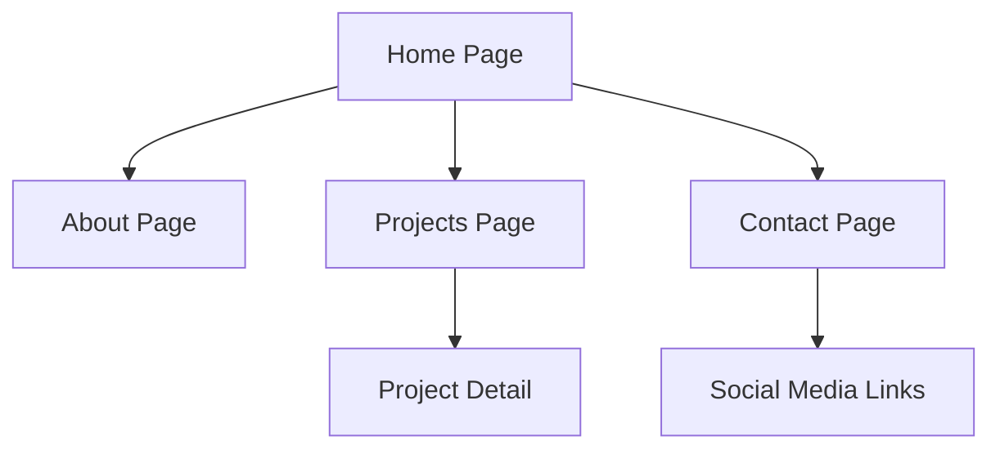

## 1. Product Overview
Website portofolio personal modern yang menampilkan karya, pengalaman, dan keahlian dalam desain yang estetik dan profesional. Tampilan minimalis dengan animasi halus menciptakan pengalaman visual yang memukau untuk memperkuat personal branding.

Target pengguna adalah profesional kreatif, developer, designer, dan freelancer yang ingin memamerkan karya mereka secara online dengan gaya modern dan elegan.

## 2. Core Features

### 2.1 User Roles
Tidak diperlukan user roles karena ini adalah website portofolio personal yang bersifat statis untuk publik.

### 2.2 Feature Module
Website portofolio ini terdiri dari halaman-halaman utama berikut:
1. **Home page**: hero section dengan animasi teks, navigasi, dan gambar profil.
2. **About page**: informasi personal, keahlian, dan pengalaman kerja.
3. **Projects page**: daftar proyek dengan filter kategori dan detail proyek.
4. **Contact page**: formulir kontak dan informasi sosial media.

### 2.3 Page Details
| Page Name | Module Name | Feature description |
|-----------|-------------|---------------------|
| Home page | Hero section | Tampilkan animated text dengan Framer Motion, background gradient dinamis, dan foto profil dengan hover effect. |
| Home page | Navigation | Sticky navigation bar dengan smooth scroll ke section, indikator aktif section, dan mobile hamburger menu. |
| Home page | Skills showcase | Grid animasi keahlian teknis dengan icon dan progress bar, muncul saat scroll. |
| About page | Personal info | Tampilkan foto, nama, title, dan deskripsi singkat dengan animasi fade-in. |
| About page | Experience timeline | Timeline vertikal pengalaman kerja dengan animasi scroll trigger dan card flip effect. |
| About page | Education & Certifications | List pendidikan dan sertifikasi dengan hover animation dan modal detail. |
| Projects page | Project grid | Masonry layout untuk project cards dengan filter kategori, hover zoom effect, dan loading skeleton. |
| Projects page | Project detail | Modal atau halaman terpisah untuk detail proyek: gambar gallery, deskripsi, tech stack, dan link demo. |
| Contact page | Contact form | Formulir kontak dengan validasi real-time, loading state, dan success animation. |
| Contact page | Social links | Grid icon sosial media dengan hover rotation effect dan link ke profile. |

## 3. Core Process
Pengunjung dapat menjelajahi website secara intuitif melalui navigasi yang smooth. Mereka dapat melihat hero section terlebih dahulu, kemudian scroll ke bawah untuk melihat keahlian. Melalui navigation bar, mereka dapat berpindah ke halaman About untuk membaca profil lengkap, ke halaman Projects untuk melihat portfolio karya, dan ke halaman Contact untuk menghubungi pemilik portofolio.

## 4. User Interface Design

### 4.1 Design Style
- **Primary colors**: Gradient ungu ke biru (#8B5CF6 ke #3B82F6) untuk aksen utama
- **Secondary colors**: Abu-abu gelap (#1F2937) untuk teks, putih (#FFFFFF) untuk background
- **Button style**: Rounded-lg dengan shadow dan hover effect, gradient background
- **Font**: Inter untuk heading, Poppins untuk body text
- **Layout style**: Full-width sections dengan container max-w-7xl, card-based untuk konten
- **Icon style**: Lucide React icons dengan outline style, ukuran 24px default

### 4.2 Page Design Overview
| Page Name | Module Name | UI Elements |
|-----------|-------------|-------------|
| Home page | Hero section | Gradient background animasi, teks berjalan dengan Framer Motion, foto profil bulat dengan border gradient, CTA button dengan pulse effect. |
| Home page | Navigation | Transparent navbar yang berubah solid saat scroll, menu items dengan underline hover animation, mobile menu dengan slide animation. |
| About page | Timeline | Line vertikal dengan dot indicators, card miring bergantian kiri-kanan, animasi saat masuk viewport. |
| Projects page | Filter buttons | Pill-shaped buttons dengan active state berwarna, smooth transition saat filtering. |
| Contact page | Form fields | Input fields dengan floating labels, border glow effect saat focus, submit button dengan loading spinner. |

### 4.3 Responsiveness
Desktop-first approach dengan breakpoint:
- Desktop: 1280px ke atas
- Tablet: 768px - 1279px  
- Mobile: 767px ke bawah

Touch interaction dioptimalkan untuk mobile dengan tap targets minimal 44px, swipe gesture untuk image gallery, dan virtual keyboard consideration untuk form fields.

### 4.4 Animation Guidelines
- Scroll-triggered animations menggunakan Intersection Observer
- Stagger animation untuk list items (delay 0.1s antar item)
- Spring physics untuk gesture animations
- Parallax effect yang subtle untuk background elements
- Loading states dengan skeleton screens
- Page transitions dengan fade dan slide combination