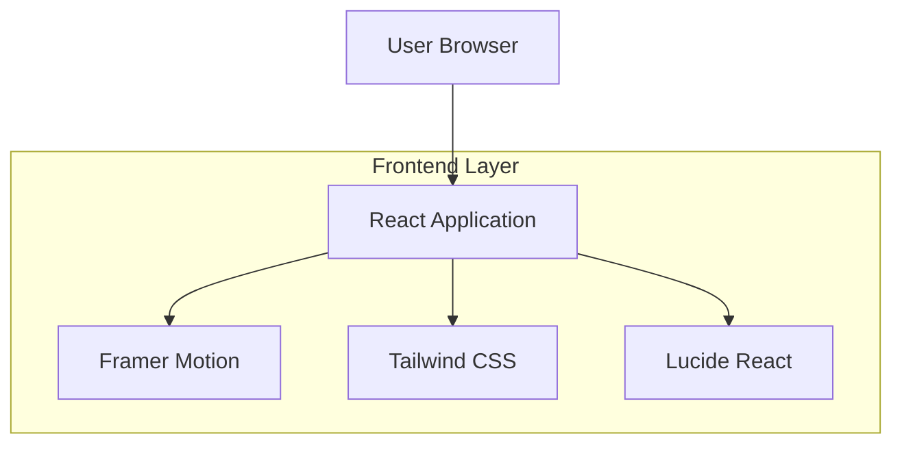

## 1. Architecture design



## 2. Technology Description

- Frontend: React@18 + tailwindcss@3 + vite
- Initialization Tool: vite-init
- Animation Library: framer-motion@10
- Icon Library: lucide-react@latest
- Backend: None (Static Portfolio Site)
- Additional Dependencies:
  - react-intersection-observer (for scroll animations)
  - react-hook-form (for contact form)
  - @emailjs/browser (for email sending)

## 3. Route definitions

| Route | Purpose |
|-------|---------|
| / | Home page with hero section and skills showcase |
| /about | About page with personal information and experience timeline |
| /projects | Projects page with filterable project grid |
| /contact | Contact page with form and social links |

## 4. Component Architecture

### 4.1 Core Components Structure

```
src/
├── components/
│   ├── layout/
│   │   ├── Navigation.jsx
│   │   ├── Footer.jsx
│   │   └── Layout.jsx
│   ├── home/
│   │   ├── Hero.jsx
│   │   ├── Skills.jsx
│   │   └── FeaturedProjects.jsx
│   ├── about/
│   │   ├── PersonalInfo.jsx
│   │   ├── ExperienceTimeline.jsx
│   │   └── Education.jsx
│   ├── projects/
│   │   ├── ProjectGrid.jsx
│   │   ├── ProjectCard.jsx
│   │   ├── ProjectDetail.jsx
│   │   └── CategoryFilter.jsx
│   ├── contact/
│   │   ├── ContactForm.jsx
│   │   └── SocialLinks.jsx
│   └── common/
│       ├── AnimatedSection.jsx
│       ├── Button.jsx
│       └── LoadingSpinner.jsx
├── hooks/
│   ├── useScrollAnimation.js
│   └── useIntersectionObserver.js
├── utils/
│   ├── animations.js
│   └── constants.js
└── styles/
    └── globals.css
```

### 4.2 Animation Patterns

Scroll-triggered animations menggunakan custom hook:
```javascript
const useScrollAnimation = () => {
  const controls = useAnimation();
  const [ref, inView] = useInView({
    threshold: 0.1,
    triggerOnce: true
  });

  useEffect(() => {
    if (inView) {
      controls.start('visible');
    }
  }, [controls, inView]);

  return [ref, controls];
};
```

## 5. Performance Optimization

### 5.1 Code Splitting
- Lazy loading untuk setiap halaman menggunakan React.lazy()
- Preload critical components
- Image optimization dengan lazy loading

### 5.2 Animation Performance
- GPU acceleration untuk transform animations
- will-change CSS property untuk elements yang sering beranimasi
- RequestAnimationFrame untuk smooth animations

### 5.3 Bundle Size
- Tree shaking untuk unused code elimination
- Dynamic imports untuk third-party libraries
- Minification dan compression

## 6. Styling Architecture

### 6.1 Tailwind Configuration
```javascript
module.exports = {
  theme: {
    extend: {
      colors: {
        primary: {
          50: '#f5f3ff',
          500: '#8b5cf6',
          600: '#7c3aed',
          700: '#6d28d9'
        },
        secondary: {
          500: '#3b82f6',
          600: '#2563eb'
        }
      },
      animation: {
        'fade-in': 'fadeIn 0.5s ease-in-out',
        'slide-up': 'slideUp 0.6s ease-out',
        'scale-in': 'scaleIn 0.4s ease-out'
      }
    }
  }
}
```

### 6.2 Responsive Breakpoints
- Mobile: @media (max-width: 767px)
- Tablet: @media (min-width: 768px) and (max-width: 1279px)
- Desktop: @media (min-width: 1280px)

## 7. State Management

Menggunakan React Context untuk:
- Theme state (light/dark mode)
- Navigation state
- Loading states

Local state untuk:
- Form inputs
- Filter selections
- Animation controls

## 8. Deployment Configuration

### 8.1 Build Process
```bash
npm run build
```

### 8.2 Static Hosting
Compatible dengan:
- Vercel
- Netlify
- GitHub Pages
- Firebase Hosting

### 8.3 Environment Variables
```
VITE_EMAILJS_SERVICE_ID=
VITE_EMAILJS_TEMPLATE_ID=
VITE_EMAILJS_PUBLIC_KEY=
```

## 9. Browser Support

- Chrome/Edge: Latest 2 versions
- Firefox: Latest 2 versions
- Safari: Latest 2 versions
- Mobile browsers: iOS Safari, Chrome Android

## 10. Accessibility

- Semantic HTML elements
- ARIA labels untuk interactive elements
- Keyboard navigation support
- Screen reader friendly
- High contrast mode support
- Reduced motion preferences